# Ex-03EDA

## AIM
To perform EDA on the given data set. 

# Explanation
The primary aim with exploratory analysis is to examine the data for distribution, outliers and 
anomalies to direct specific testing of your hypothesis.
 

# ALGORITHM
### STEP 1
Create a new file in jupyter notebook.
### STEP 2
Upload the given csv file.
### STEP 3
Write codes for Data Analysis (EDA).
### STEP 4
Plot the result in various formats.
# STEP 5
End the program.
# CODE
```
import pandas as pd
import numpy as np
import seaborn as sns
df=pd.read_csv("")
df.info()
df.head()
df.isnull().sum()
df.drop("Cabin",axis=1,inplace=True)
df.info()
df.isnull().sum()
df["Age"]=df["Age"].fillna(df["Age"].median())
df.boxplot()
df.isnull().sum()
df["Embarked"]=df["Embarked"].fillna(df["Embarked"].mode()[0])
df["Embarked"].value_counts()
df["Pclass"].value_counts()
df["Survived"].value_counts()
sns.countplot(x="Survived",data=df)
sns.countplot(x="Pclass",data=df)
sns.countplot(x="Sex",data=df)
df.info()

sns.displot(df["Fare"])
sns.countplot(x="Pclass",hue="Survived",data=df)
sns.displot(df[df["Survived"]==0]["Age"])
pd.crosstab(df["Pclass"],df["Survived"])
pd.crosstab(df["Sex"],df["Survived"])
df.corr()
sns.heatmap(df.corr(),annot=True)
```
# OUPUT
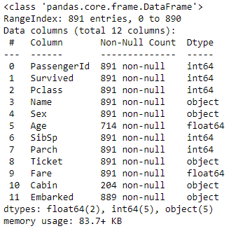

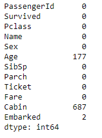
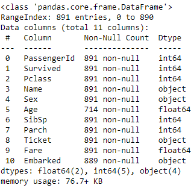
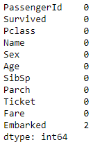

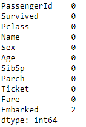


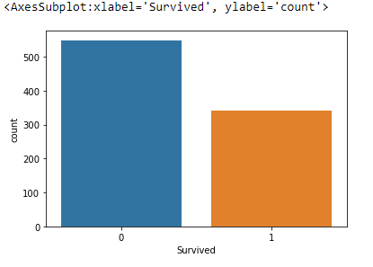
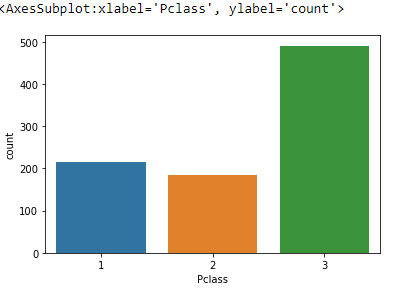

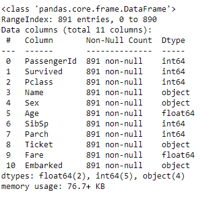
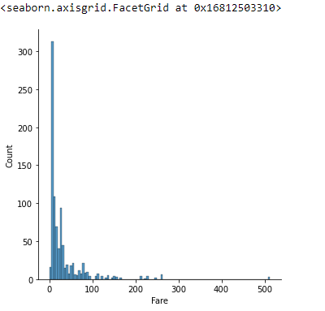
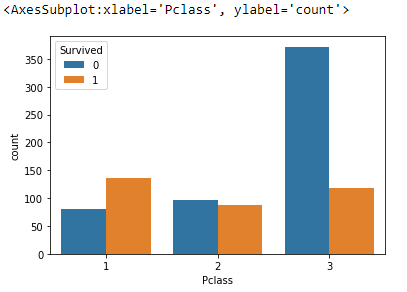

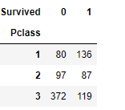
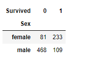
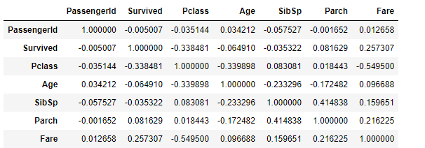
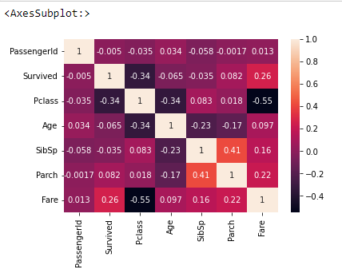